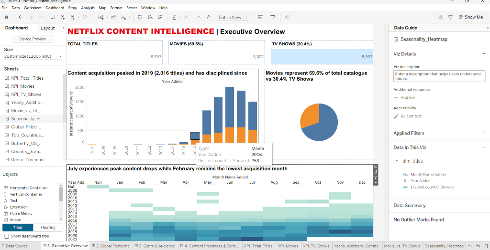
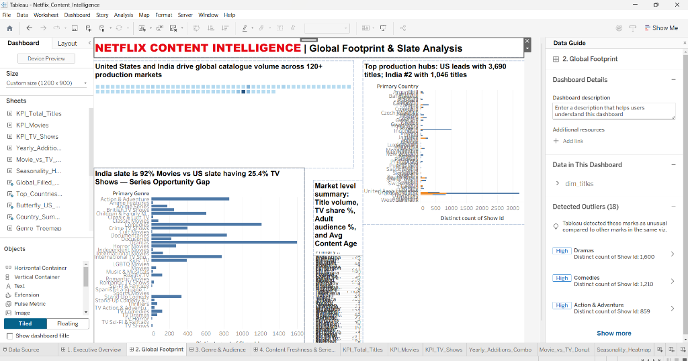
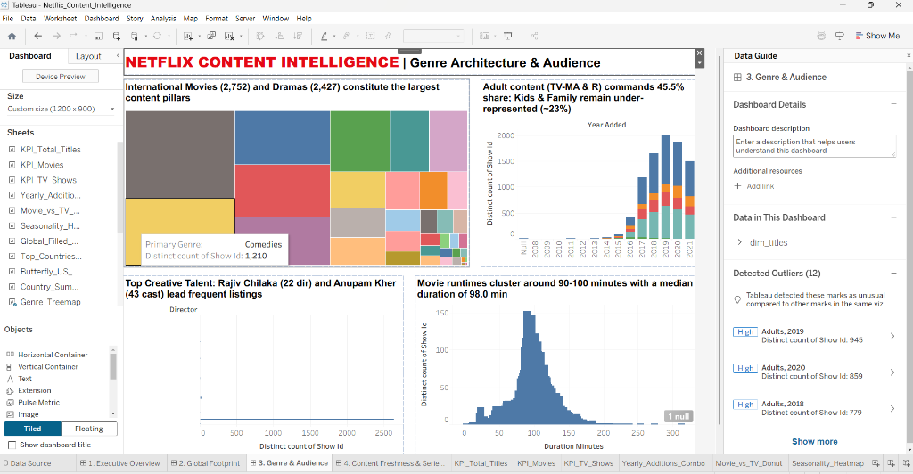
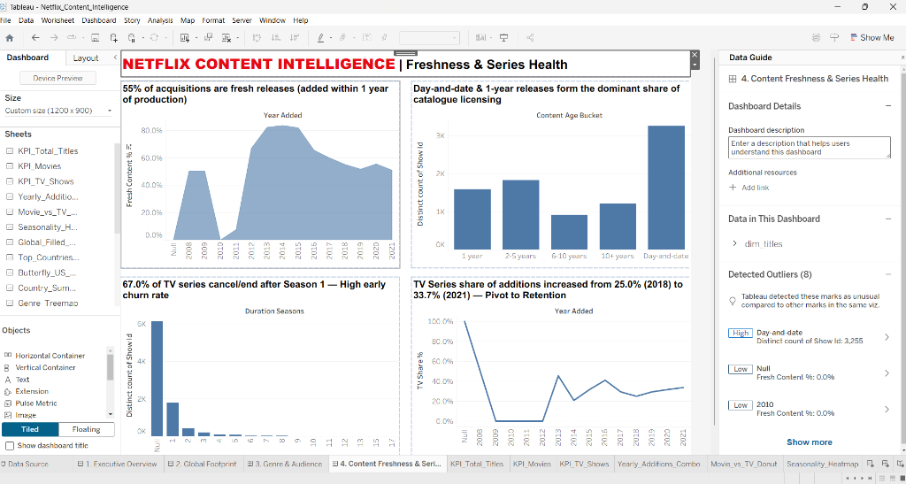

# Netflix Content Intelligence — End-to-End Data Analytics Project

**Author:** Deepanshu Garkoti — Data Analyst (SQL • Python • Tableau • Power BI)
📧 garkotideepanshu173@gmail.com | 🔗 linkedin.com/in/deepanshugarkoti | 💻 github.com/Deepanshu-tech7


---

## 1. Business Problem

Netflix operates in 190+ countries and adds thousands of titles a year. Content acquisition is
the single largest cost line for a streaming platform, so the strategy team needs to answer:

1. **What are we actually buying** — movies or series, fresh releases or back-catalogue?
2. **Which markets** are driving catalogue growth, and where is investment thinning out?
3. **Which genres and audience segments** are over- or under-served?
4. **When** does content land during the year, and does the release calendar have gaps?

This project turns the public Netflix catalogue snapshot into a decision-ready
catalogue-strategy dashboard, backed by a documented SQL model.

## 2. Dataset

| Item | Detail |
|---|---|
| Source | Netflix Movies and TV Shows (public Kaggle dataset, catalogue snapshot) |
| Grain | One row per title (`show_id`) |
| Volume | **8,807 rows × 12 columns** |
| Coverage | Titles added **Jan 2008 – Sep 2021**, release years **1925 – 2021** |
| Licence | Public / educational use |

> The dataset is a **catalogue snapshot, not a viewership log**. It tells us what Netflix
> *bought and listed*, never what people *watched*. Every insight below is framed as a
> supply-side / acquisition insight — that framing matters in interviews.

## 3. Tech Stack

Python (pandas, NumPy) · PostgreSQL · Tableau Public · Excel · Git/GitHub

## 4. Repository Structure

```
netflix-analytics/
├── data/                 raw netflix_titles.csv (immutable)
├── build.py              cleaning + feature engineering + export pipeline
├── data_clean/           netflix_clean.csv (analysis-ready)
├── sql/
│   ├── 01_schema.sql             staging + star-style model + indexes
│   ├── 02_cleaning.sql           quality audit, data repair, UNNEST loads
│   ├── 03_business_questions.sql 25 analytical queries (CTEs, windows)
│   └── 04_views_kpis.sql         reporting views for BI tools
├── tableau_data/         dim_titles + bridge tables + pre-aggregates
├── outputs/insights.json machine-readable results of every metric quoted here
└── docs/
    ├── data_dictionary.md
    ├── tableau_specs.md
    ├── insights_report.md
    ├── interview_prep.md
    └── linkedin_and_resume.md
```

## 5. Data Cleaning Summary

| Issue found | Fix applied |
|---|---|
| Rows where the **duration value sat in the `rating` column** | Value moved to `duration`, rating set to `Not Rated` |
| ~30% of rows missing `director`, ~9% missing `cast`/`country` | Filled with `Unknown` (dropping rows would have deleted 1/3 of the catalogue) |
| `date_added` stored as free text with stray spaces | Trimmed and parsed to a real date; unparsable values kept as NULL |
| `duration` mixed "90 min" and "2 Seasons" in one column | Split into `duration_minutes` and `duration_seasons` |
| `country`, `listed_in`, `cast` were comma-separated multi-value fields | Unnested into bridge tables (many-to-many) so counts don't double-count |

**Engineered features:** `year_added`, `month_added`, `quarter_added`, `content_age_at_add`,
`is_fresh_add`, `primary_country`, `primary_genre`, `audience_segment`, `cast_size`,
`decade_released`.

## 6. Headline Insights

1. **Movie-heavy catalogue:** 6,131 movies (69.6%) vs 2,676 TV shows (30.4%).
2. **2019 was peak acquisition** — 2,016 titles added. It fell to 1,879 in 2020 (−6.8%) and
   1,498 in 2021, i.e. the land-grab phase ended and buying became selective.
3. **Series share is rising**: TV was 25.0% of additions in 2018 → 33.7% in 2021 — a deliberate
   shift toward retention-driving originals rather than one-off movies.
4. **US dominates, India is the clear #2:** US 3,690 titles, India 1,046, UK 806.
   India's slate is **92% movies** while the US slate is **25.4% TV** — India is being served
   as a film market, which is a visible content-strategy gap.
5. **Fresh content strategy:** median gap between release and being added is **1 year**, and
   **55%** of titles are added within a year of release.
6. **Audience skew to Adults:** TV-MA (3,207) + R (799) push the Adults segment to **45.5%**;
   Kids + Older Kids together are only ~23%.
7. **Format discipline:** average movie runtime **99.6 min** (median 98) and **67% of TV shows
   have only one season** — a high rate of non-renewal.
8. **Seasonality:** July is the heaviest month for additions, February the lightest.

## 7. Recommendations

| # | Recommendation | Backed by |
|---|---|---|
| 1 | Grow **Indian original series**, not just film licensing — 92% of the India slate is movies while series drive subscription retention | Insight 4 |
| 2 | Protect the **family/kids tier** — only ~23% of the catalogue is Kids/Older Kids, a weak spot against Disney+ | Insight 6 |
| 3 | Set a **renewal review gate at season 1** — 67% single-season rate means acquisition spend is not converting into franchises | Insight 7 |
| 4 | Smooth the **Q1 release calendar** (Feb is the weakest month) to reduce churn in the post-holiday window | Insight 8 |
| 5 | Hold the **fresh-content ratio above 50%** as an explicit KPI; freshness is the visible differentiator vs library-heavy rivals | Insight 5 |

## 8. Tableau Dashboards Showcase

The analytics suite comprises **4 strategic Tableau dashboards** designed for content strategy and acquisition leadership:

### 📊 Dashboard 1: Executive Overview
> **Core Focus:** Overall portfolio volume (8,807 titles), Movie vs TV split (69.6% vs 30.4%), acquisition cadence peaking in 2019 (2,016 additions), and monthly seasonality (July peak vs February lull).



---

### 🌍 Dashboard 2: Global Footprint & Slate Analysis
> **Core Focus:** Geographic coverage across 120+ production markets, Top 10 production hubs (US leads with 3,690 titles; India #2 with 1,046 titles), and the India slate disparity (92% movies vs 8% series).



---

### 🎭 Dashboard 3: Genre Architecture & Audience
> **Core Focus:** Primary genre distribution (International Movies, Dramas, Comedies lead), adult rating skew (45.5% TV-MA/R vs ~23% Kids/Family), top talent frequency, and movie runtime distribution (median 98 min).



---

### ⚡ Dashboard 4: Freshness & Series Health
> **Core Focus:** Content freshness at licensing (55% added within 1 year of release), TV series cancellation bottleneck (67% single-season shows), and the strategic pivot toward series for subscriber retention (25.0% TV share in 2018 → 33.7% in 2021).



## 9. How to Reproduce

```bash
pip install pandas numpy
python build.py                 # writes data_clean/, tableau_data/, outputs/insights.json

psql -d netflix -f sql/01_schema.sql
psql -d netflix -c "\copy netflix_raw FROM 'data/netflix_titles.csv' CSV HEADER"
psql -d netflix -f sql/02_cleaning.sql
psql -d netflix -f sql/03_business_questions.sql
psql -d netflix -f sql/04_views_kpis.sql
```

## 10. Limitations

Snapshot as of Sep 2021, no viewership/revenue data, `country` is production country rather
than availability region, and ~30% of titles have no director credited.
